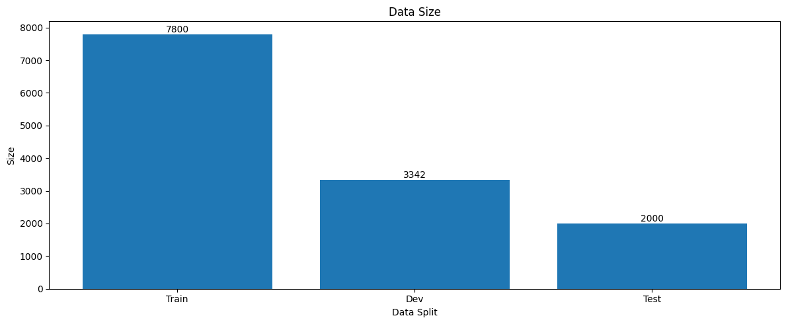

# Preliminary Study

## Sizes of train/dev/test splits

    

## Feature charactersistics
train:  
Max length: 1707, Min length: 30, Mean length: 223.33, Variance: 23508.68, Std: 153.33

dev:  
Max length: 1218, Min length: 35, Mean length: 224.32, Variance: 23128.59, Std: 152.08

ser_test_1:  
Max length: 1222, Min length: 32, Mean length: 227.95, Variance: 18763.53, Std: 136.98

ser_test_2:  
Max length: 1596, Min length: 21, Mean length: 197.81, Variance: 21304.37, Std: 145.96

## Emotion label distribution (train)
(0, 0): sadness  
(0, 1): anger  
(1, 0): pleasure  
(1, 1): joy  

    

## Emotion label distribution (dev)
(0, 0): sadness  
(0, 1): anger  
(1, 0): pleasure  
(1, 1): joy

    

